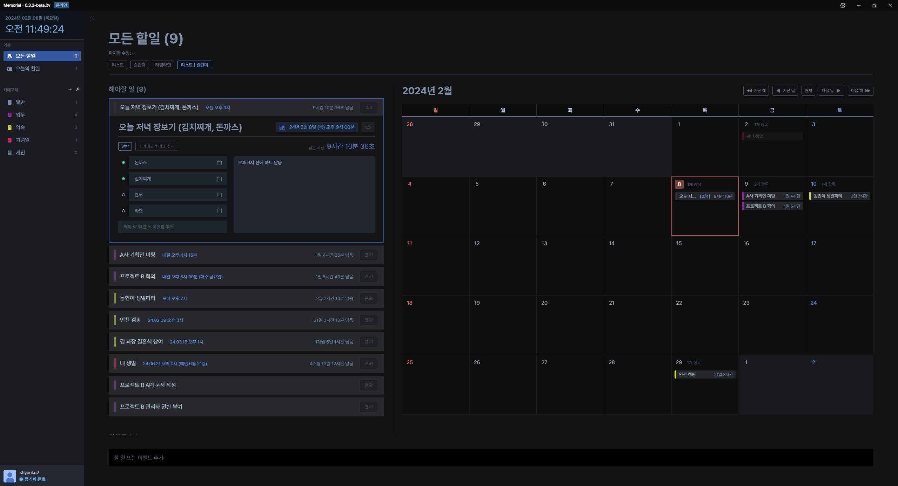

# Thread

This repository includes the code for Thread, desktop application for Windows, Mac and Linux.
Thread is a simple and easy to use application that allows you to create tasks or schedules for your own.

**Track. Handle. Remember. Execute. And Deliver.**
You can add memo, title, deadline, category to create a task.
Thread is a free and open source application. \
Unfortunately, download of Thread is only available from github releases.
(download page will be available soon)

## Preview

## Features

- Create, edit, delete tasks
- Add memo, title, deadline, category to create a task
- Automatically synchronize through the cloud (self-made server)
- Compatible with Windows, Mac & iOS/Android Thread application
- Free and open source (for now)
- Supports multiple view types (list, calendar, timeline, etc.)
- Automatically update on startup if there is a new version (testing)
- Automatically starts when the computer starts (can be turned off in settings)
- Supports only Korean, but most of the language can be supported to use.

## Installation

1. Download the latest version from the [releases page]
2. Install the downloaded file
3. Run the installed application
4. Create an account and log in
5. Start using Thread

## Development

Use Node.js 22.12 or newer and pnpm 8.15.9 for desktop dependencies.
Electron is pinned to 43.6.0 on the E2EE development branch. Windows builds
now require a 64-bit OS (x64); macOS 12 or newer is required. The app ID and
user data paths are unchanged. An upgrade from an existing ia32 installation
still needs validation; 32-bit Windows cannot run this build. Native macOS
signing and upgrade tests are still required before distribution.
The local `.npmrc` keeps standalone installs hoisted for CRA compatibility.

Run `pnpm dev:desktop` from the monorepo root. Development runs as
`Thread Dev` with Windows AppUserModelID `kr.threadapp.desktop.dev`.
Its Electron profile and single-instance lock use `appData/thread-dev`
(`%APPDATA%/thread-dev` on Windows), independently of the installed app.
Existing project-local development task databases and the installed app's
data are not moved or deleted. Restart the dev process once after this change.
Each environment still allows only one instance of its own.

Thread is developed with Electron, React, and Golang. \
If you want to contribute to the development of Thread, please contact us.
