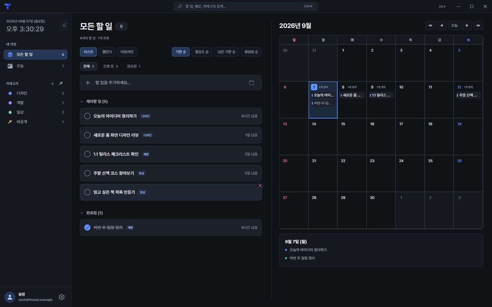
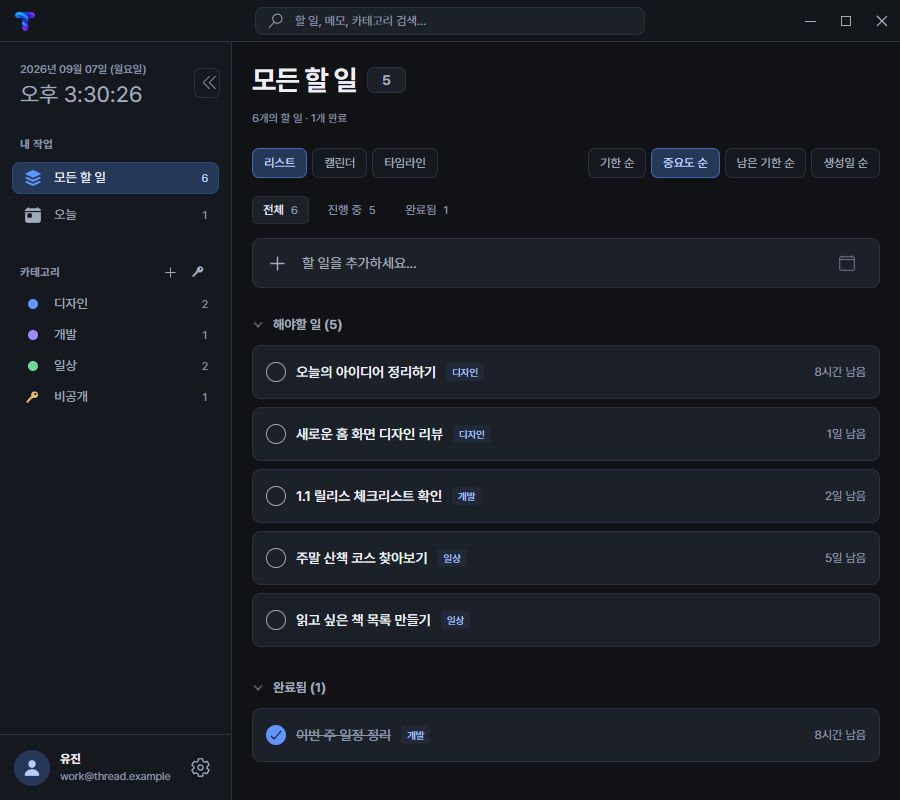
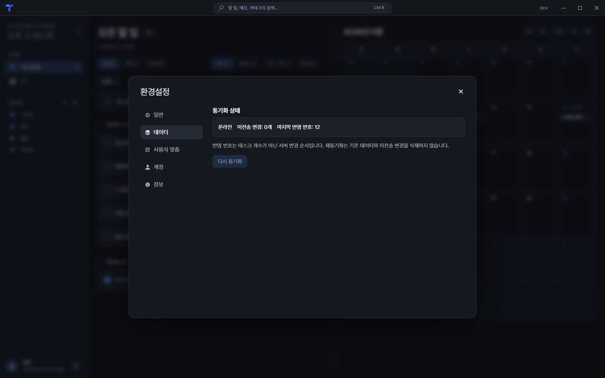

# Desktop visual refresh

작성: 2026-09-07 14:00 (KST)

사용자가 제공한 다크 작업 관리 화면을 #37의 시각 기준으로 사용한다. Electron/React 및 기존 IPC·서버 API·데이터 모델·동기화/마이그레이션 경로를 유지한다.

## Palette

| 역할 | 색 |
| --- | --- |
| Canvas | #101216 |
| Sidebar / panel | #15181e |
| Elevated input / card | #1c2028 |
| Hover | #252b36 |
| Border | #2b303b |
| Primary text | #edf1f7 |
| Secondary text | #a0aaba |
| Muted text | #8792a4 |
| Accent / focus | #6294ff |
| Selected background | #253858 |
| Secondary accent | #a18aff |
| Success / warning / danger | #70d5a0 / #edbc72 / #f0838b |

## Layout and behavior

- 42px 상단: 좌측 12px 여백의 26px Thread 로고(글자 없음), 창 전체 중앙의 28px 검색창(Ctrl/Cmd+K), 기존 창 제어.
- 232px 사이드바: 오늘/전체, 기존 카테고리 및 보안 카테고리 관리, 계정과 설정.
- 현재 시간은 22px, 시계 아래 여백은 기존보다 10px 추가한다. 오늘/전체 메뉴는 32px, 카테고리 행은 26px 높이다. 카테고리 제목 아래 여백은 6px이다.
- 목록 요약과 캘린더 항목은 12px 남은 시간을 가장 큰 단위 하나로 내림 표시한다(1시간 35분 → 1시간 남음). 지난 기한은 같은 규칙으로 지남을 표시하고 펼친 상세 타이머는 기존 다중 단위를 유지한다.
- 캘린더 항목 제목은 12px이며 날짜 셀의 콘텐츠 폭이 100px 이상일 때 남은 시간을 표시한다. 시간은 '남음' 없이 opacity 0.4로 표시하고 만료된 경우에는 '지남'을 유지한다. 월/년의 시간 환산은 기존 포맷터를 유지한다.
- 분할 목록은 카드 바깥 삭제 버튼의 7px 돌출 폭을 수용하는 우측 8px 여백으로 가로 스크롤을 방지한다.
- 작업 영역: 제목, 보기 및 정렬 선택, 전체/진행 중/완료 필터, 상단 추가 입력. 고정 안내 문구는 제거하고 검색 중에만 검색 결과 설명을 표시한다.
- 선택 가능한 보기는 리스트(기본), 캘린더, 타임라인. 창 너비 1100px 초과 시 리스트/캘린더는 모두 두 열로 표시하고, 이하에서는 선택한 뷰만 표시한다. 창 크기를 바꿔도 선택은 유지하며 타임라인은 기존 단독 보기를 유지한다.
- 검색창 폭은 이전보다 30px 넓은 min(470px, 40vw + 30px)이다. 요일과 날짜 셀 모두 gap 없이 배치하고 pointer-events 없는 pseudo-element의 내부 2px 경계로 그린다. 분수 배율에서도 선이 남도록 보강하며 선택 날짜는 파란 경계를 유지한다.
- 사이드바 접기 버튼은 Home 레이아웃에서 사이드바 오른쪽 안쪽 12px에 배치한다. 접으면 좌측 가장자리 중앙에 아이콘 없는 6×88px 핸들(클릭 영역 12×88px)을 남기고, hover/focus 시 강조한다. 키보드로도 다시 펼칠 수 있다. 프로필 영역은 78px에서 66px로 줄인다. 분할 보기의 정렬 옵션·추가 입력·목록은 우측 8px 여백을 공유한다.
- 검색은 이미 접근 가능한 작업의 제목·메모·카테고리명에 적용하는 renderer 필터다. 보안 카테고리 필터를 우회하지 않는다.
- 중요/즐겨찾기/휴지통처럼 현재 저장 모델에 없는 기능은 시각적 버튼만 만들지 않는다.
- 날짜 선택 상세는 현재 필터의 작업만 보여준다. 완료/수정/삭제/정렬/반복/하위 작업은 기존 콜백을 사용한다.
- 설정·컨텍스트 메뉴·날짜 선택·로그인·로딩/오류 표면은 같은 토큰을 사용한다.
- 키보드 focus ring, 검색 Escape, 실제 button, reduced-motion을 반영한다.

## Verification

실제 사용자 데이터 대신 synthetic fixture로 주요 화면·빈 상태·좁은 창·검색/필터·기존 편집 콜백을 검증한다. 최종 사용자 시각 검수 전에는 #37을 WIP로 유지한다.

검증 결과: 2026-09-07 14:29 (KST)

- Renderer Jest 31개 통과. 검색·완료 필터가 보안 카테고리 가시성을 유지하고 추가/완료가 기존 IPC 인자를 전달함을 회귀 테스트로 확인했다.
- 실제 Edge headless에 synthetic Task/Category와 IPC fixture를 연결해 Ctrl+K/Escape 검색, 비공개 검색 제외, 카테고리/완료 필터, 추가/완료/제목 수정 호출, 상세 편집, 월 이동/날짜 상세, 설정의 v2 상태, 중요도 정렬/타임라인, 사이드바 접기, 빈 상태를 확인했다.
- 1600×1000과 1280×800에서는 두 열, 900×800에서는 세로 배치를 확인했다. 가로 페이지 넘침과 JS runtime error가 없었다.
- Production renderer build 통과. 기존 lint/React test-utils deprecation 경고는 남아 있다.
- 변경은 renderer와 디자인 문서 범위다. Electron main/IPC 서비스·서버·DB·모바일은 변경하지 않았다. 실제 사용자 데이터, 로그인 세션 또는 운영 API로 브라우저 검증하지 않았다.
- 설치 파일 패키징과 사용자 시각 검수는 이번 검증에 포함하지 않는다. 현재 dev 실행에서 화면을 확인할 수 있다.

## Preview

후속 보완 검증: 2026-09-07 15:30 (KST)

- 접기 버튼이 사이드바 안쪽 12px인지, 접힌 핸들의 좌측 위치·12×88px 영역·아이콘 미표시·펼치기 동작, 프로필 높이 66px을 실제 브라우저에서 확인했다.
- 요일 헤더까지 픽셀 검사 범위를 확장해 날짜 셀과 같은 배율/높이 9가지 조합에서 모든 내부 가로·세로 경계 색을 확인했다.

스크린샷 후속 검수: 2026-09-07 15:27 (KST)

- 사용자 환경에서 경계 누락이 지속되어 기존 1px gap 좌표 검증만으로는 충분하지 않음을 확인했다. 내부 1px 선 보강도 DPR 1.25에서 실제 픽셀 검사에 실패했다.
- 내부 2px 선으로 수정한 후 DPR 1/1.25/1.5, viewport 1919px 및 높이 1031/1032/1033px 조합에서 모든 날짜 행/열의 경계 색(일반/선택)을 스크린샷 픽셀로 확인했다.
- 정렬 옵션·추가 입력·목록의 우측 끝 차이 1px 미만, 카테고리 행 26px, 사이드바 경계 버튼 및 접기/펼치기, 기존 UI 동작 검증 통과. Renderer 41개 테스트와 production build 통과(기존 lint 경고).
- 실제 Electron 사용자 화면의 최종 시각 검수는 여전히 별도다.

반응형 보기 조정 검증: 2026-09-07 15:17 (KST)

- Renderer 41개 테스트 및 production build 통과(기존 경고). 1100/1101px 경계와 선택한 리스트/캘린더 유지, 타임라인 단독 표시를 회귀 테스트에 추가했다.
- Synthetic 브라우저에서 1099/1100/1101/1281/1599/1600/1601/2000px로 반복 변경해 뷰 표시 및 셀 사이의 1px 가로/세로 간격을 확인했다. 2000px 화면을 촬영해 경계와 흐린 단일 단위 시간을 시각 확인했다.
- 검색 폭 470px, 메뉴 높이 32px, 캘린더 시간 opacity 0.4와 '남음' 제거, 기존 검색/편집/설정 기능 검사를 통과했다.

추가 조정 검증: 2026-09-07 15:07 (KST)

- 카테고리 헤더와 보안 카테고리의 키 그림은 80%로 축소하고 클릭 영역은 유지했다.
- 설정 메뉴 글자/아이콘 15px, 본문 제목 16px, 설명/버튼/동기화 요약 14px, 정보 항목 15px로 확대했다.
- Synthetic 브라우저에서 900/1280/1600px 검색창 중앙 정렬, 로고 좌측 12px, 키 크기, 설정 메뉴/본문 치수 및 기존 기능 검사를 통과했다. Production renderer build도 통과했다(기존 lint 경고).

추가 피드백 검증: 2026-09-07 14:59 (KST)

- Renderer 40개 테스트 통과. 단일 단위 내림 경계와 기존 다중 단위 포맷 유지 포함.
- 실제 브라우저에서 상단 42px·로고 26px·검색창 28px·시계 22px·기본 메뉴 36px·시계 하단 padding 26px을 측정했다.
- 900/1280/1600px에서 분할 목록에 hover해 내부 가로 넘침이 없는지 검사했다. 이전에는 목록 clientWidth 599px 대비 scrollWidth 602px이었으며 수정 후 넘침이 없다.
- 캘린더 단독 넓은 보기에서 남은 시간 표시, 좁은 보기에서 숨김, 항목 12px 및 목록 단일 단위 표시를 확인했다. 기존 검색/추가/완료/편집/설정/보기 전환 검증도 통과했다.
- Production renderer build 통과(기존 lint 경고). 상세 타이머 구현과 데이터/IPC는 변경하지 않았다.

아래 이미지는 실제 변경된 React 컴포넌트에 가짜 데이터를 넣어 촬영한 화면이다.

